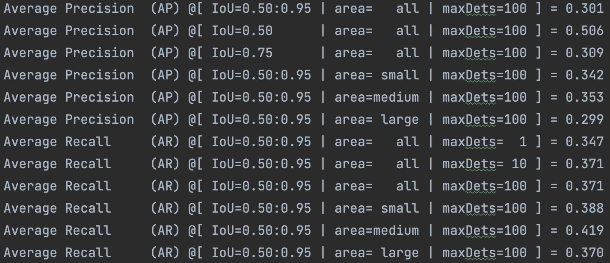
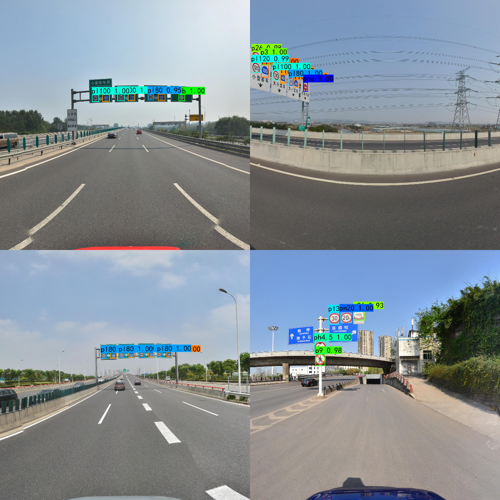

## YOLOV4-TT100K: 基于YOLOV4训练的交通标志检测模型

> 非常感谢 [bubbliiiing](https://github.com/bubbliiiing) 分享的 [yolov4-pytorch](https://github.com/bubbliiiing/yolov4-pytorch) 的代码，里面包含了丰富的注释，非常便于理解.

* * *

 
The demo of yolov4-tt100k.

##### 在原始代码基础上：

1. 修改数据加载类，支持CoCo格式（使用cocoapi）；
2. 修改数据增强；
3. validation增加mAP计算；
4. 修改anchor；

注: 实验开启weight_decay或是 不对conv层和FC层的bias参数，以及BN层的参数进行权重衰减，mAP下降很大，mAP@[.5:.95]=0.244

##### 训练集

[Tsinghua-Tencent 100K](http://cg.cs.tsinghua.edu.cn/traffic-sign/)

> 下载的训练集主要包含train和test两部分，分别为6107和3073张图片。统计标注文件，共221类。详细统计每类标志个数，发现很多类的数量为0，所以清楚了部分数量为0的label，剩下类别为151，其中仍存在很多类数量<5.

 
训练集标签数量统计.

TT100k转为CoCo格式：

参考 [yolo-v3脚本](https://github.com/TalkUHulk/yolov3-TT100k/blob/main/scripts/tt100k2coco.py)

`python  scripts/tt100k2coco.py`

##### 测试

[pretrained model](https://pan.baidu.com/s/1xfLWib3mrIkK9NJs5l5nFQ)
密码: lcou

下载到model_data,运行:`python predict.py`

##### 结果

 
mAP of yolov4

对比yolov3:

 
mAP of yolov3

如上，mAP不高，分析原因，可能如下：

1. 数据集分辨率2048x2048，yolov4输入为608,且交通标志中存在很多小物体，原图resize到608，很多目标太小难以检测；
2. 某些类别数量过少；

可优化:

1. 借鉴YOLT方法检测小物体；
2. 数据集扩充/增强；
3. 使用更优秀的检测方法；
4. 改进loss，解决类别不均衡[可参考](pytorch_yolov3解决类别不均衡导致MAP较低的问题)

 
